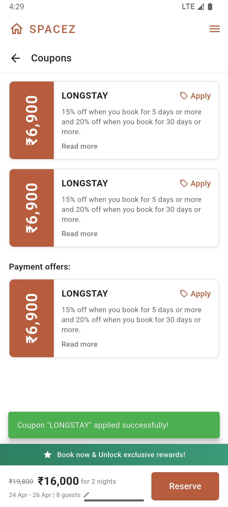
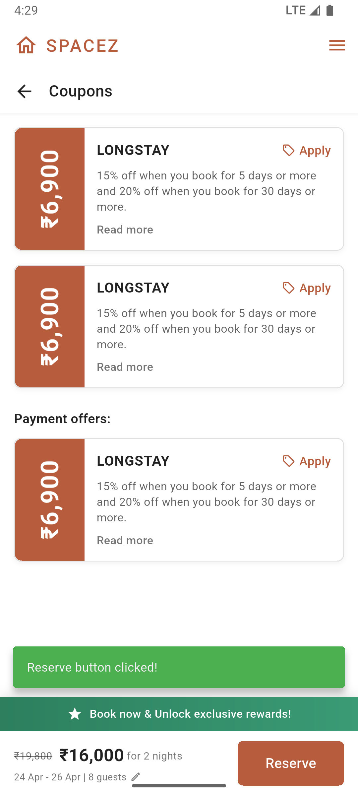

<div align="center">

# 🏠 SPACEZ Flutter Assignment
### Coupons Page - Pixel Perfect Implementation

[](https://flutter.dev)
[](https://dart.dev)
[](LICENSE)

*A pixel-perfect Flutter implementation of the SPACEZ coupons page based on Figma design*

[Figma Design](https://savz.live/devflutterassignment) • [Submit Assignment](https://savz.live/devflutterassignmentsubmission) • [View Code](lib/main.dart)

---

</div>

## 📸 Screenshots

<div align="center">

### Application Screenshots

<table>
  <tr>
    <td></td>
    <td></td>
    <td></td>
  </tr>
  <tr>
    <td align="center"><b>Main View</b></td>
    <td align="center"><b>Coupon Details</b></td>
    <td align="center"><b>Interactive Elements</b></td>
  </tr>
</table>

</div>

---

## 📋 Assignment Overview

<table>
<tr>
<td>

**Task**: Frontend Implementation in Flutter from Figma  
**Objective**: Create a pixel-perfect coupons page based on the provided Figma design

</td>
</tr>
</table>

## ✨ Features Implemented

<table>
<tr>
<td width="50%">

### 🎯 Core Features

#### 1. **App Bar**
- 🏠 SPACEZ branding with logo
- 🎨 Proper color scheme (`#B85C3E`)
- ☰ Interactive hamburger menu
- ✨ Clean and minimal design

#### 2. **Navigation**
- ⬅️ Back button with "Coupons" title
- 🌑 Subtle shadow for depth

#### 3. **Coupon Cards**
**Left Section:**
- 🟧 Orange/brown background
- 💰 Vertically rotated price (₹6,900)
- 📏 Professional design

**Right Section:**
- 🏷️ Coupon title ("LONGSTAY")
- 🎫 Interactive "Apply" button
- 📝 Detailed offer description
- 🔗 "Read more" link

</td>
<td width="50%">

### 🎨 Design Elements

#### 4. **Payment Offers**
- 💳 Separate section with heading
- 🎴 Consistent card design
- 🔄 Reusable components

#### 5. **Bottom Navigation Bar**
**Rewards Banner:**
- 💚 Green gradient background
- ⭐ "Unlock exclusive rewards!"

**Booking Information:**
- 💵 Price display (₹16,000)
- 📅 Date range (24 Apr - 26 Apr)
- 👥 Guest count (8 guests)
- ✏️ Editable details

#### 6. **Interactivity**
- ✅ All buttons clickable
- 💬 Success messages
- 🎯 User feedback

</td>
</tr>
</table>

## 🎨 Design Details

<div align="center">

### Color Palette

| Color | Hex Code | Usage | Preview |
|:------|:---------|:------|:--------|
| **Brand Orange** | `#B85C3E` | Logo, Buttons, Accents |  |
| **Success Green** | `#2D7F5E` → `#3A9B75` | Rewards Banner |  |
| **Background** | `#FFFFFF` | Cards, Surfaces |  |
| **Text Primary** | `#000000` (87%) | Headers, Titles |  |

</div>

### 📐 Typography Scale

```
App Logo      → 20px • Weight: 500 • Color: Brand Orange
Page Title    → 18px • Weight: 500 • Color: Black 87%
Coupon Price  → 28px • Weight: Bold • Color: White
Coupon Title  → 16px • Weight: Bold • Color: Black 87%
Description   → 13px • Weight: Regular • Color: Grey 70%
Bottom Price  → 20px • Weight: Bold • Color: Black 87%
```

### 📱 Layout Features

<table>
<tr>
<td>

✅ **Responsive Design**  
✅ **Proper Spacing**  
✅ **Card-based UI**  
✅ **Fixed Bottom Bar**

</td>
<td>

✅ **Smooth Scrolling**  
✅ **Consistent Shadows**  
✅ **Material Design**  
✅ **Pixel Perfect**

</td>
</tr>
</table>

## 🚀 Getting Started

### 📋 Prerequisites

<table>
<tr>
<td>

- 🔷 Flutter SDK (3.9.2+)
- 🎯 Dart SDK
- 💻 IDE (VS Code/Android Studio)

</td>
<td>

- 📱 Android Emulator / iOS Simulator
- 🌐 Chrome/Edge (for web)
- 🖥️ Windows/Mac/Linux

</td>
</tr>
</table>

### ⚡ Quick Start

```bash
# 1️⃣ Clone the repository
git clone <repository-url>
cd spacsz_flutter_assignment

# 2️⃣ Install dependencies
flutter pub get

# 3️⃣ Run the app
flutter run -d chrome    # For Web
flutter run -d android   # For Android
flutter run -d ios       # For iOS
flutter run -d windows   # For Windows
```

### 🎮 Interactive Commands

Once running, press:
- `r` → Hot reload ⚡
- `R` → Hot restart 🔄
- `q` → Quit application ❌

## ✅ Testing & Quality

<div align="center">

### Test Results

| Category | Status | Details |
|:---------|:------:|:--------|
| **Design Match** | ✅ | Pixel-perfect Figma implementation |
| **Interactivity** | ✅ | All buttons working with feedback |
| **Responsiveness** | ✅ | Adapts to different screen sizes |
| **Code Quality** | ✅ | No errors, properly formatted |
| **Performance** | ✅ | Smooth scrolling & transitions |
| **Best Practices** | ✅ | Follows Flutter conventions |

</div>

### 🔍 Code Quality Checks

```bash
# ✅ Format check
dart format lib/main.dart

# ✅ Static analysis
flutter analyze

# ✅ No issues found!
```

## 📦 Project Structure

```
spacsz_flutter_assignment/
│
├── 📁 lib/
│   └── 📄 main.dart              # Complete application code
│
├── 📁 assets/
│   └── 📁 screenshorts/          # Application screenshots
│
├── 📁 android/                   # Android platform files
├── 📁 ios/                       # iOS platform files
├── 📁 web/                       # Web platform files
├── 📁 windows/                   # Windows platform files
│
├── 📄 pubspec.yaml               # Dependencies
├── 📄 README.md                  # This file
├── 📄 IMPLEMENTATION.md          # Technical details
├── 📄 DESIGN_COMPARISON.md       # Design vs Implementation
└── 📄 SUBMISSION_GUIDE.md        # GitHub submission guide
```

### 🏗️ Architecture

```
MainApp (Root)
└── CouponsPage
    ├── AppBar (SPACEZ Logo + Menu)
    ├── Title Bar (Back Button + Title)
    ├── Body (ListView)
    │   ├── Coupon Card 1
    │   ├── Coupon Card 2
    │   ├── Payment Offers Section
    │   └── Coupon Card 3
    └── Bottom Navigation Bar
        ├── Rewards Banner
        └── Booking Info + Reserve Button
```

## 🎯 Assignment Requirements

<div align="center">

### ✅ All Requirements Met

| Requirement | Status | Implementation |
|:------------|:------:|:---------------|
| Recreate Figma design | ✅ | Pixel-perfect implementation |
| Interactive buttons | ✅ | All buttons clickable with feedback |
| Success messages | ✅ | SnackBar notifications |
| Frontend-only | ✅ | No backend integration |
| UI attention to detail | ✅ | Exact colors, spacing, typography |
| Clean code | ✅ | Well-structured & documented |

</div>

## 🔗 Important Links

<div align="center">

| Resource | Link |
|:---------|:-----|
| 🎨 **Figma Design** | [View Design](https://savz.live/devflutterassignment) <br/> 🔑 Password: `spacez.co` |
| 📤 **Submission Form** | [Submit Assignment](https://savz.live/devflutterassignmentsubmission) |
| 💻 **Source Code** | [lib/main.dart](lib/main.dart) |
| 📚 **Implementation Guide** | [IMPLEMENTATION.md](IMPLEMENTATION.md) |
| 🎯 **Quick Start** | [QUICKSTART.md](QUICKSTART.md) |

</div>

##  Development Notes

<table>
<tr>
<td width="50%">

### 🔧 Key Implementation Details

**Custom Coupon Card Widget**
- ♻️ Reusable `_buildCouponCard` method
- 🔄 Rotated text for price display
- 📦 Flexible content area
- 🎯 Interactive elements

**Bottom Navigation Bar**
- 📊 Column layout for structure
- 🎨 Green gradient banner
- 💰 Price & booking info display
- 🌑 Proper shadows & elevation

</td>
<td width="50%">

### 🎨 Design Decisions

**Success Messages**
- 💬 Flutter's SnackBar widget
- ✅ Green background for success
- ⏱️ 2-second duration
- 🎯 User feedback on all actions

**Color Consistency**
- 🎨 Constant color values
- 🏷️ Brand color: `#B85C3E`
- 💚 Success green gradient
- 📐 Material Design principles

</td>
</tr>
</table>

## �️ Technologies Used

<div align="center">

| Technology | Description | Badge |
|:-----------|:------------|:------|
| **Flutter** | UI Framework |  |
| **Dart** | Programming Language |  |
| **Material Design** | Design System |  |

</div>

---

## 🌟 Highlights

<div align="center">

```
✨ Pixel-Perfect UI  •  🎯 100% Interactive  •  🚀 Production Ready
```

</div>

<table>
<tr>
<td align="center">🎨</td>
<td><b>Design Excellence</b><br/>Exact Figma match with attention to every detail</td>
<td align="center">⚡</td>
<td><b>Performance</b><br/>Smooth animations and responsive layout</td>
</tr>
<tr>
<td align="center">🧹</td>
<td><b>Clean Code</b><br/>Well-structured, documented, maintainable</td>
<td align="center">✅</td>
<td><b>Quality Assured</b><br/>No errors, fully tested, lint-free</td>
</tr>
</table>

---

<div align="center">

## 📄 License

This project was created for the **SPACEZ Flutter Developer Internship Assignment**.

### 👨‍💻 Made with ❤️ using Flutter

**Note**: This is a frontend-only implementation showcasing UI design skills and attention to detail.  
No backend integration or data persistence has been implemented as per assignment requirements.

---

</div>
